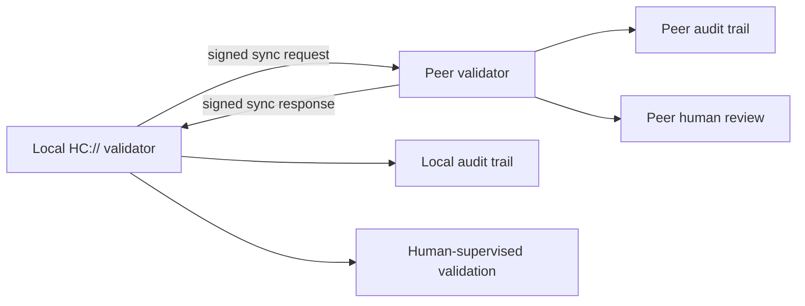
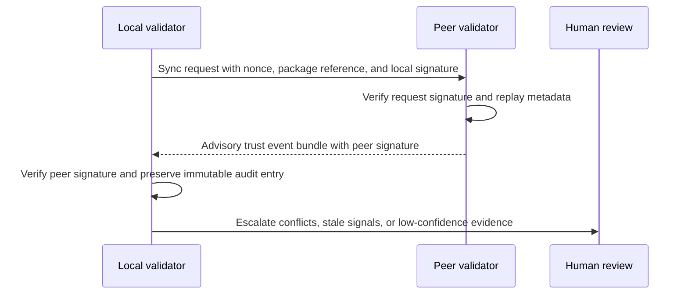
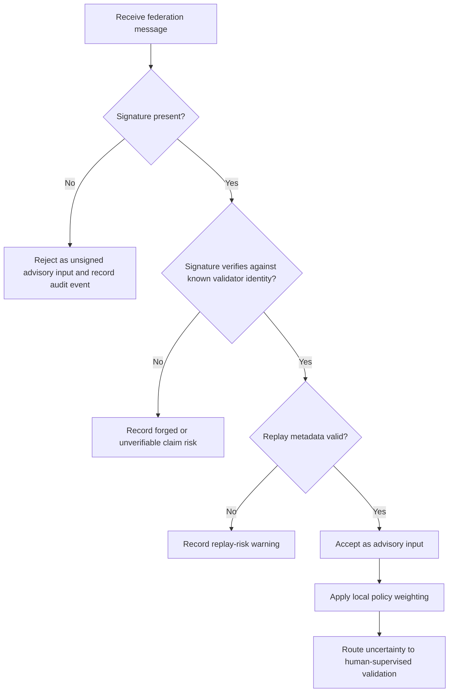
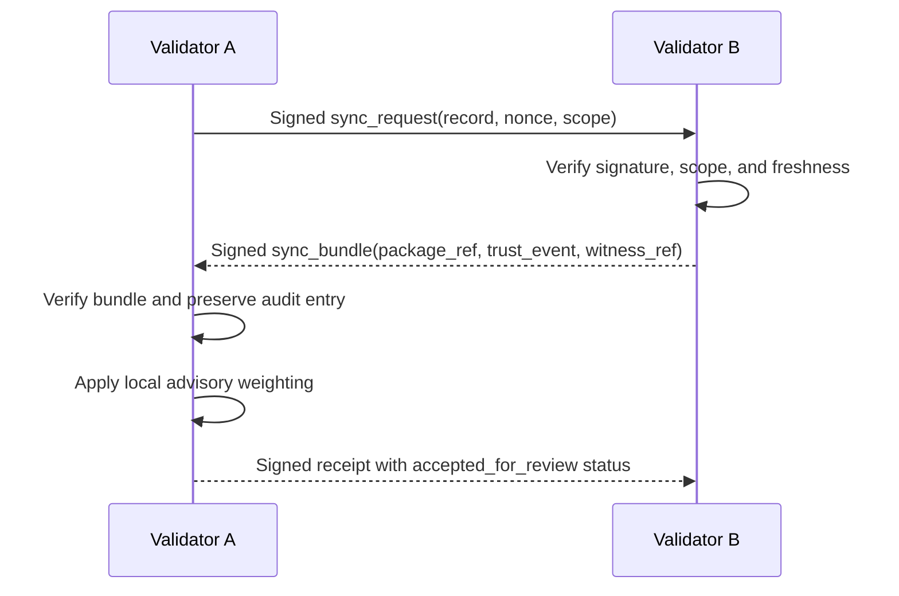
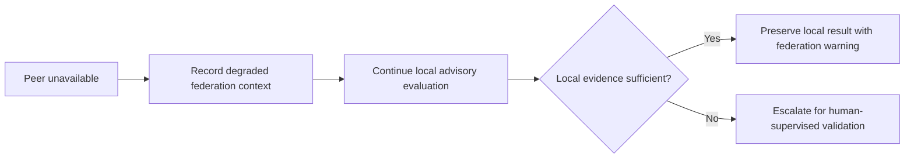

# Validator Federation Synchronization Architecture

Metadata:

- advisory_only=true
- public_safe=true
- truth_guarantee=false
- Runtime behavior change: none.
- Schema mutation: none.
- Validator logic mutation: none.
- Signing logic mutation: none.
- Federation logic mutation: none.
- Canonical artifact mutation: none.
- Human final authority: required.

## Purpose

This document describes an advisory architecture for how distributed HC:// validators may synchronize trust signals and verification state without changing runtime behavior, validator logic, signing semantics, schema contracts, federation behavior, policy evaluator behavior, or canonical record boundaries.

Federation synchronization is a review and coordination surface. It does not make remote validators authoritative over local HC:// decisions. The local validator remains authoritative for its own validation state, audit trail, and human-supervised validation workflow.

## Validator Federation Overview

A validator federation is a set of HC:// validator nodes that exchange signed, bounded synchronization messages. Each message can reference verification packages, witness observations, trust score deltas, and audit trail checkpoints.

Federation nodes are advisory peers. They can provide corroborating signals, missing context, or disagreement evidence, but they cannot override a local validator, replace the canonical record process, or bypass human-supervised validation.



## Trust Exchange Model

Trust exchange is based on signed advisory events:

- validator identity evidence
- signature metadata
- verification package references
- witness references
- trust score deltas or rationale
- replay-protection metadata
- audit trail pointers

Trust exchange must preserve local interpretation. A remote trust score is input evidence, not a binding decision.



## Verification Package Sharing

Verification packages can be shared as non-authoritative review bundles. Importing a package does not mutate canonical records or replace local validation output. The receiving validator should record package provenance, verify signatures, and preserve the import as audit trail context.

### Example: verification package export/import

```json
{
  "type": "hc_verification_package_export",
  "hc_protocol": "HC://",
  "package_id": "pkg-advisory-2026-05-29-001",
  "source_validator": "validator-a",
  "record_reference": "hc://record/example",
  "exported_at": "2026-05-29T00:00:00Z",
  "signature_reference": "sig:validator-a:example",
  "advisory_only": true,
  "truth_guarantee": false
}
```

```json
{
  "type": "hc_verification_package_import",
  "hc_protocol": "HC://",
  "package_id": "pkg-advisory-2026-05-29-001",
  "receiving_validator": "validator-b",
  "import_result": "accepted_for_review",
  "canonical_mutation_performed": false,
  "human_supervised_validation_required": true
}
```

## Signature Verification Flow

Every federation message must be signature-checked before it influences local advisory state. Failed signature validation must be preserved as an audit event and must not be silently accepted.



## Federation Sync Lifecycle

1. **Discovery:** identify peer validators through approved local configuration or review channels.
2. **Request:** send a signed request containing nonce, timestamp, package or witness references, and requested scope.
3. **Verification:** verify peer identity, message signature, replay metadata, and declared scope.
4. **Exchange:** receive advisory verification package, trust score, witness, or state-delta events.
5. **Local evaluation:** apply local validator policy weighting without authority override.
6. **Audit preservation:** append request, response, verification result, warnings, and conflict markers to the audit trail.
7. **Human review:** escalate disagreement, stale propagation, spoofing indicators, or trust-kernel uncertainty.

## Conflict Resolution Rules

Conflicts are preserved, not hidden. A local validator should record divergent peer claims as parallel evidence until human-supervised validation resolves the review path.

| Conflict type | Local handling | Escalation trigger |
| --- | --- | --- |
| Signature mismatch | Mark as unverifiable and exclude from trust score influence. | Any forged or unexpected validator claim. |
| Different verification result | Preserve both results with provenance. | Result affects user-facing interpretation or canonical record review. |
| Stale trust score | Keep as historical advisory context. | Remote score is older than local freshness policy. |
| Witness disagreement | Record witness branches separately. | Witness affects provenance continuity or anti-spoofing review. |
| Federation partition | Mark degraded federation context. | Missing quorum-like corroboration is being used in review language. |

## Replay Protection Expectations

Federation messages should include replay-resistant metadata:

- unique message identifier
- nonce or challenge reference
- source validator identity
- receiving validator identity
- creation timestamp
- expiration or freshness window
- signature over the complete message body
- prior event hash when continuity is claimed

Replay detection is advisory unless implemented and validated elsewhere in the repository. Replay-risk findings must remain visible in the audit trail and should route to human-supervised validation.

## Trust Score Propagation

Trust score propagation communicates peer-local scoring context. It does not require the receiver to adopt the peer score.

### Example: trust score exchange

```json
{
  "type": "hc_trust_score_event",
  "source_validator": "validator-a",
  "target_subject": "hc://record/example",
  "score": 0.74,
  "score_basis": [
    "signature_verified",
    "witness_corroborated",
    "package_hash_matched"
  ],
  "issued_at": "2026-05-29T00:00:00Z",
  "expires_at": "2026-05-30T00:00:00Z",
  "advisory_only": true
}
```

Receiving validators should:

- verify the score event signature;
- check freshness and replay metadata;
- map the peer score to local weighting rules;
- preserve the original score, adjusted local interpretation, and rationale in the audit trail;
- escalate unexplained score shifts for human-supervised validation.

## Validator to Validator Sync Example



Example message shape:

```json
{
  "type": "validator_sync_request",
  "from": "validator-a",
  "to": "validator-b",
  "scope": "verification_state_summary",
  "record_reference": "hc://record/example",
  "nonce": "nonce-2026-05-29-a",
  "created_at": "2026-05-29T00:00:00Z",
  "signature_reference": "sig:validator-a:sync-request"
}
```

## Witness Propagation

Witness propagation shares observations while preserving witness provenance and local review boundaries. A propagated witness event should identify the observing validator, original witness source, timestamp, signature, and any confidence limitations.

### Example: witness propagation

```json
{
  "type": "hc_witness_propagation_event",
  "propagating_validator": "validator-b",
  "originating_witness": "witness-17",
  "subject": "hc://record/example",
  "observation": "package_hash_matched",
  "observed_at": "2026-05-29T00:00:00Z",
  "propagated_at": "2026-05-29T00:05:00Z",
  "signature_reference": "sig:validator-b:witness-event",
  "advisory_only": true,
  "human_supervised_validation_required": true
}
```

## Federation Failure Handling

Federation failure must degrade gracefully and visibly. A local validator should not infer stronger confidence because a peer is unreachable, partitioned, stale, or inconsistent.

Failure handling expectations:

- preserve failed sync attempts in the audit trail;
- keep local validation available when local evidence is sufficient;
- mark federation context as degraded when peer evidence is unavailable;
- avoid replacing missing peer input with fabricated defaults;
- route security-sensitive or trust-kernel-impacting ambiguity to human-supervised validation.



## Security Requirements and Boundaries

Federation synchronization must preserve these security boundaries:

- **Signature validation required:** every inbound federation event must be signature-checked before local advisory use.
- **Immutable audit preservation:** accepted, rejected, stale, replayed, and conflicting federation events must remain visible in the audit trail.
- **No authority override:** remote validators cannot override local validator decisions, canonical record review, or human-supervised validation.
- **Federation nodes are advisory:** peer inputs are corroborating evidence, not final authority.
- **Local validator remains authoritative:** each validator owns its local state, local policy weighting, and local audit trail interpretation.
- **No runtime implementation claim:** this document does not add federation runtime behavior or assert production readiness.

## Human Review Escalation

Escalate to human-supervised validation when federation input includes:

- forged, unverifiable, or unexpected validator claims;
- stale trust propagation that could affect user-facing interpretation;
- witness spoofing indicators;
- replay-risk warnings;
- conflicting verification package state;
- degraded federation context during trust-kernel review;
- any proposed change to schema contracts, signing semantics, validator logic, federation behavior, policy evaluator behavior, or canonical record boundaries.

## Related Review Aid

Use `docs/security/federation-risk-checklist.md` as an advisory checklist when reviewing federation synchronization proposals.
